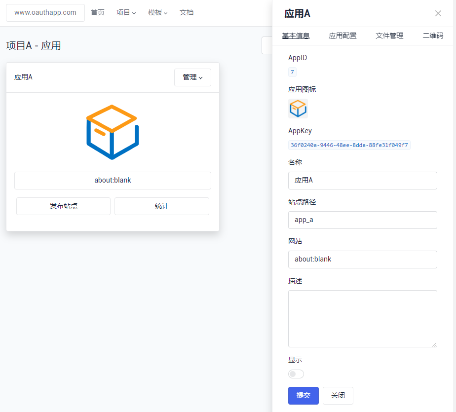
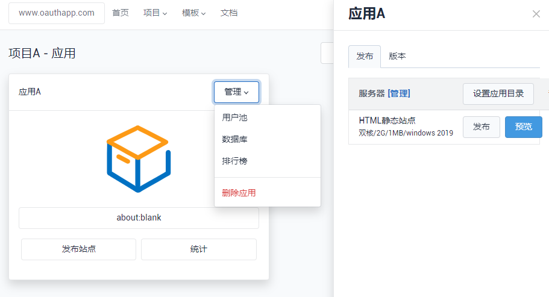
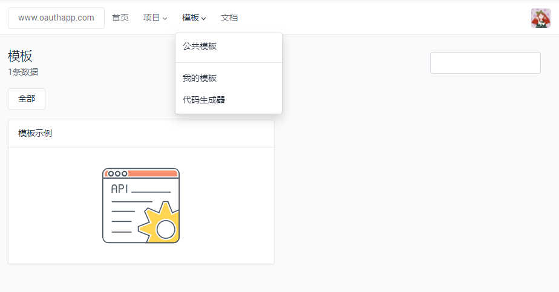
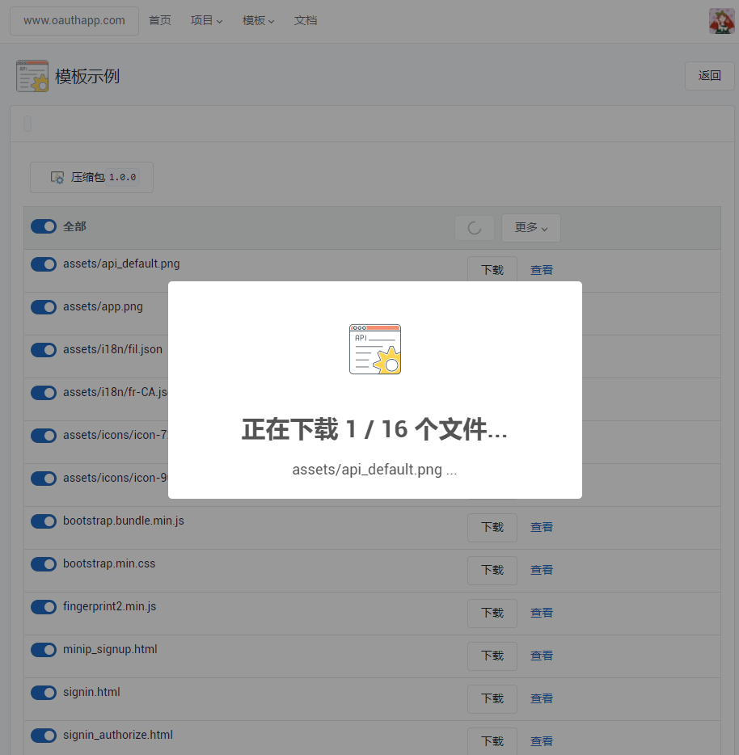

# OAuthApp

#### 介绍
H5应用、模板共享平台。

SAAS架构，每个二级域名都是独立数据库、用户池、账号系统。

功能特性：

- 1，在线发布H5应用到服务器
- 2，用户池、数据库、排行榜3个模块可快速实现业务需求
- 3，模板中心、代码生成器，在线制作，在线部署

#### 软件架构
.Net Core 5.0

#### 截图预览

##### 应用配置

##### 发布应用

##### 模板中心

##### 下载模板

