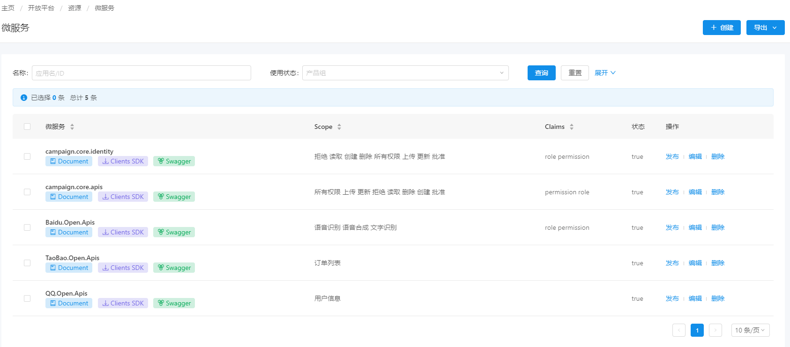
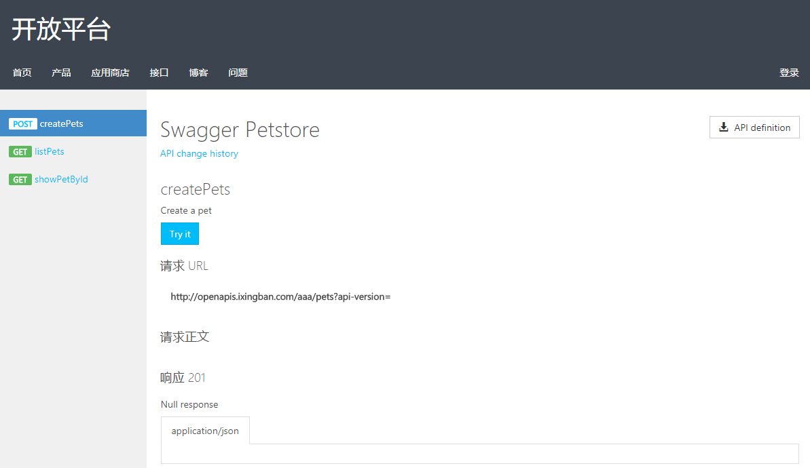
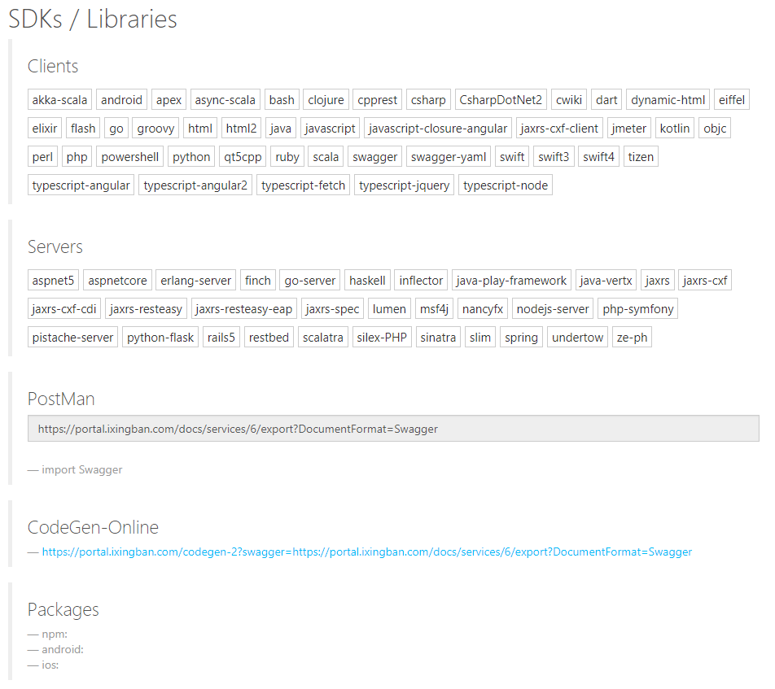
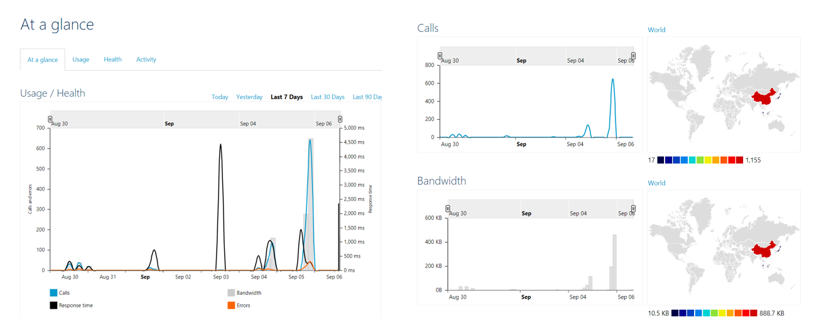
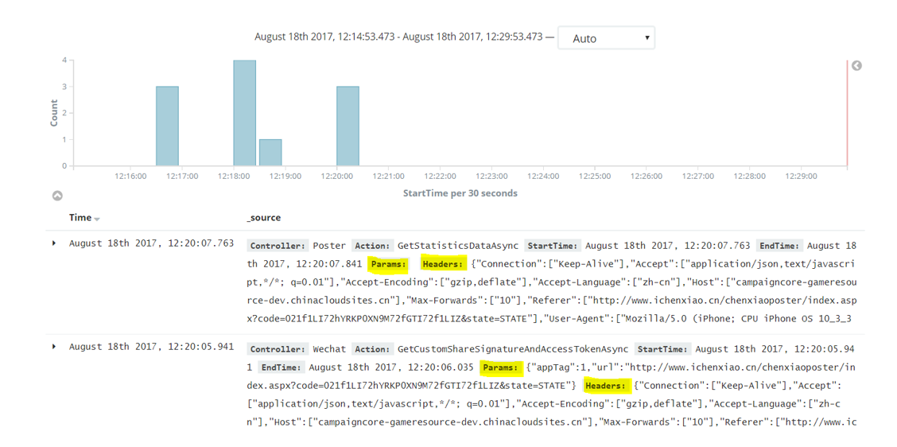


  

# OAuthApp

OAuthApp是一个免费开源的微服务框架，基于IdentityServer4、Azure API Management构建。 

OAuthApp | OAuthApp.AzureJobs
--------------- | ---------------
|

核心功能
--
* 统一管理微服务、用户、客户端的Sass授权中心
* 集成Azure API Management  [🐱‍🏍示例](https://portal.ixingban.com)
* 自动生成接口文档、Server/Client端SDK包、推送Android/IOS/Npm/Nuget平台   [🐱‍🏍示例](https://portal.ixingban.com/docs/services/59f97c558826900ef0b57d7a/operations/59f98c018826900e60abf936)

截图
--

Acknowledgements
--
  OAuthApp is built using the following great open source projects
  
* [IdentityServer4](https://github.com/IdentityServer)
* [ASP.NET Core](https://github.com/aspnet)
* [Azure API Management](https://azure.microsoft.com/zh-cn/services/api-management/)
* [Swagger Codegen](https://github.com/swagger-api/swagger-codegen)

For run this project recommends
--
* Azure Key Valut (统一配置，将Appsetting的配置、SSL证书迁移到Azure Key Valut等)
* Azure Redis & SqlCache（缓存）
* Azure SqlServer （持久存储，User、Client、ApiResource等数据）
* Azure Storage （Table/Queue/Blob）
* Email & Message （Send Cloud）
* Elastic Search （请求日志） 

> 目前主要由[seven1986](https://github.com/seven1986)创建和维护。