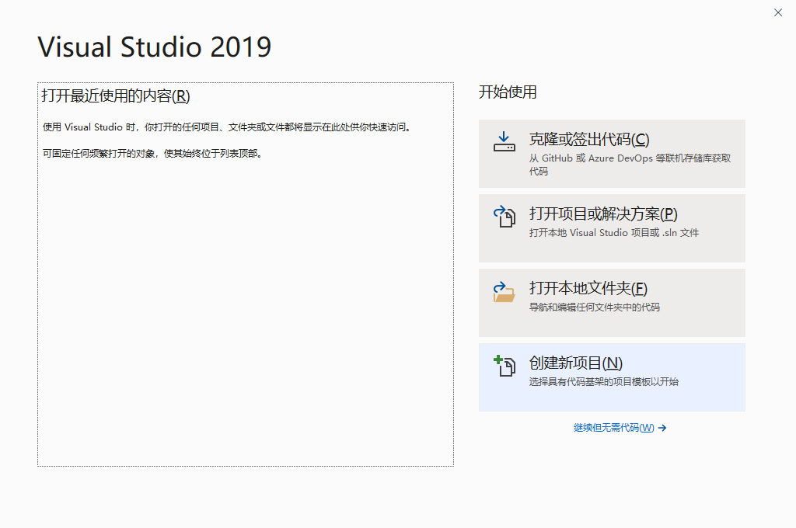
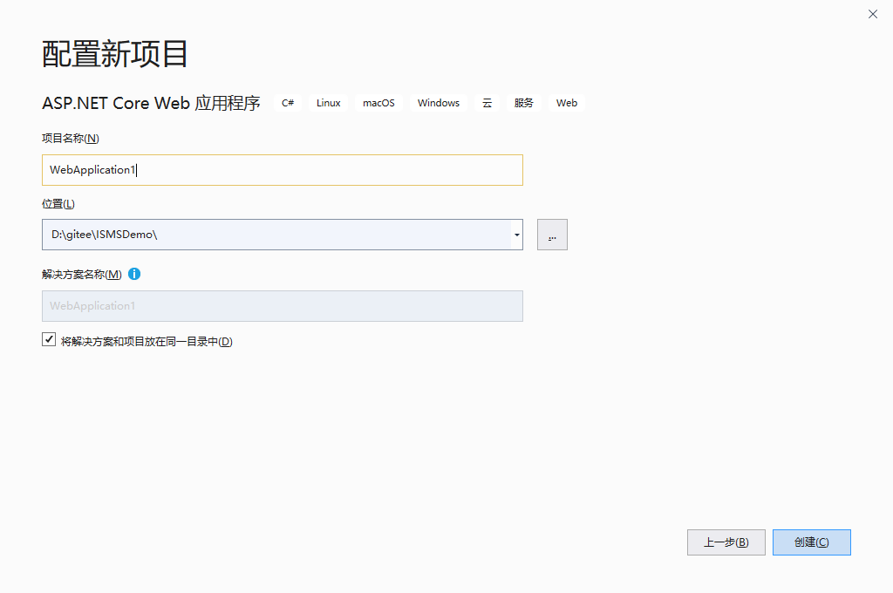
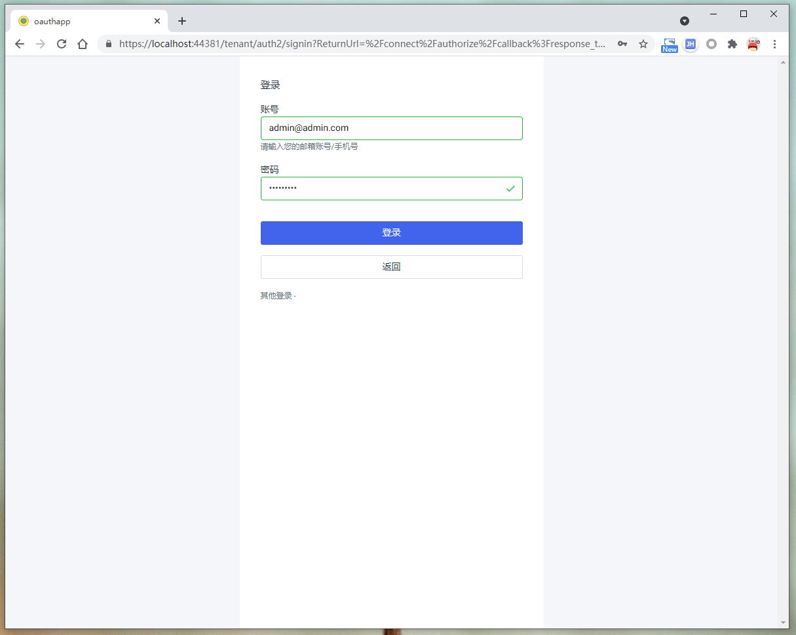
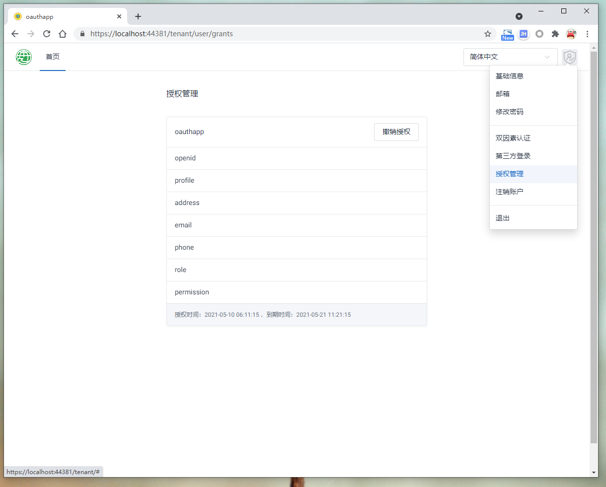
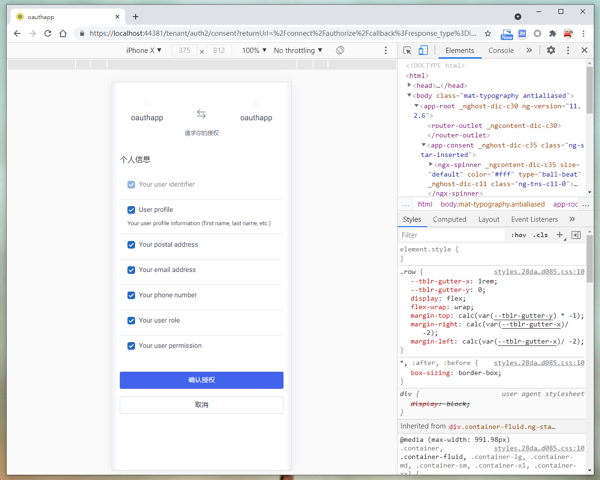
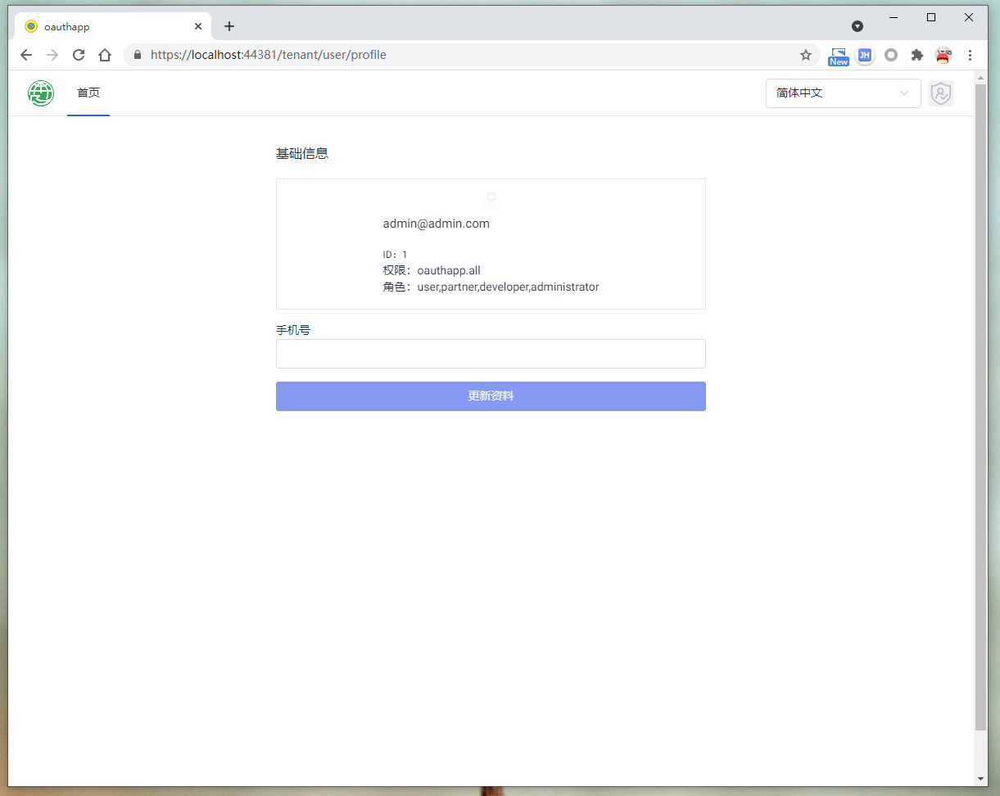
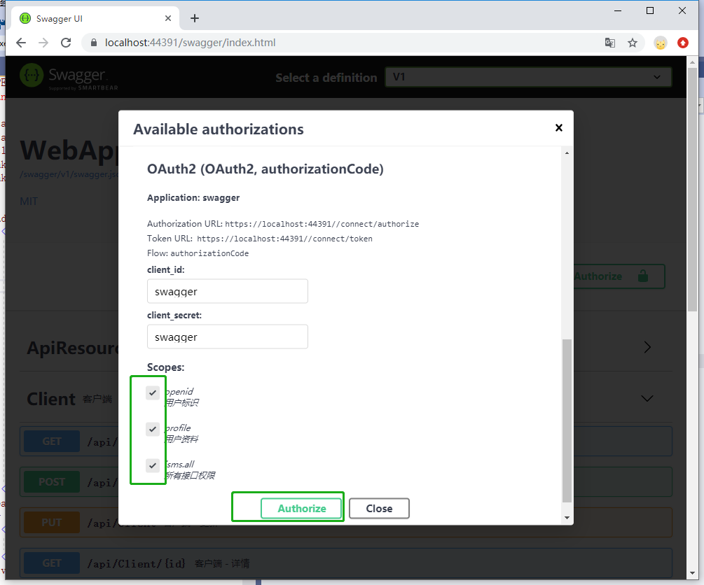
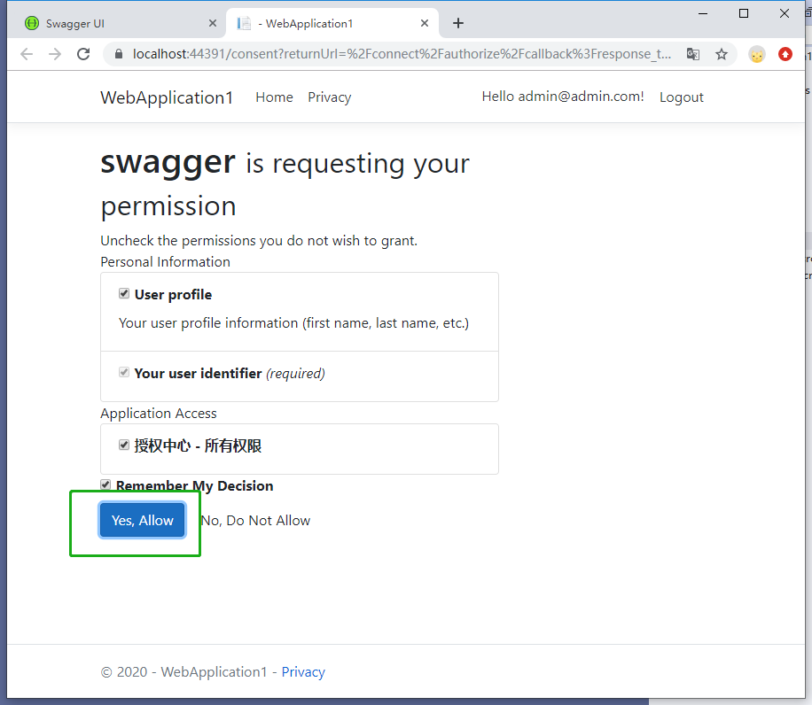

# 创建标识服务器

!!! note ""
    OAuthApp是一个基于AspNetCoreIdentity、IdentityServer4的框架，可以帮助快速搭建具有开放平台的用户中心。
    
	参考如下步骤，搭建标识服务器。请确保您已经安装了[Visual Studio 2019](https://visualstudio.microsoft.com/zh-hans/vs/)、[DotNet Core 3.1](https://dotnet.microsoft.com/download/dotnet-core/3.1)、[SQL Server](https://www.microsoft.com/zh-cn/sql-server/sql-server-downloads)。

## 1，创建应用程序






## 2，安装Nuget包

!!! note ""
    对项目的依赖项点右键，选择管理Nuget程序包


!!! note ""
    输入OAuthApp，然后点击安装


## 3，配置


### 3.1 appsetting.json

!!! note ""
    对项目依次点击鼠标右键——属性——调试，复制项目网址.


!!! note ""
    复制下面代码到 **appsetting.json** 文件，注意将Host节点替换为当前项目网址，**结尾不要带“/”** 。

    **DataBaseConnection** 可替换为实际数据库的地址，**SMS** 和 **Email** 使用的是[SendCloud](https://sendcloud.sohu.com/)的服务。

=== "appsetting.json"
``` json linenums="1"
  "ConnectionStrings": {
    "DataBaseConnection": "Data Source=(localdb)\\ProjectsV13;Initial Catalog=ismsdb_demo;Integrated Security=True;Pooling=False",
    "AzureStorageConnection": "可空"
  	},
  "IdentityServer": {
    "Host": "当前项目网址，结尾不要到/",
    "SMS": {
      "apiUser": "可空",
      "apiKey": "可空"
    },
    "Email": {
      "apiUser": "可空",
      "apiKey": "可空",
      "fromEmail": "可空",
      "fromName": "可空"
    }
  }
```


### 3.2 Identity UI

!!! note ""
    打开项目的 **Views/Shared/_Layout.cshtml** 文件，添加登陆组件。
 
=== "Views/Shared/_Layout.cshtml"
``` html linenums="1"
    <partial name="_LoginPartial" />
```


### 3.3 添加并引用服务

!!! note ""
    打开 **Startup.cs** 文件，添加如下代码。


=== "Startup.cs"
    ``` csharp linenums="1"
    public void ConfigureServices(IServiceCollection services)
    {
        services.AddOAuthApp();
    }

    public void Configure(IApplicationBuilder app, IWebHostEnvironment env)
    {
        app.UseOAuthApp();
    }
    ```


## 4，    启动

!!! note ""
	启动项目并预览。默认用户账号：admin@admin.com，密码：123456aA!，拥有所有权限。







## 5，   Swagger UI

!!! note ""
    在浏览器中打开 **{项目网址}** /swagger/index.html可访问API文档。






!!! note ""
    可访问 **{项目网址}** /grants，撤销对指定client的授权。


## 6，Postman

使用 [Postman](https://www.postman.com/downloads){: .md-button } 测试现有接口。


