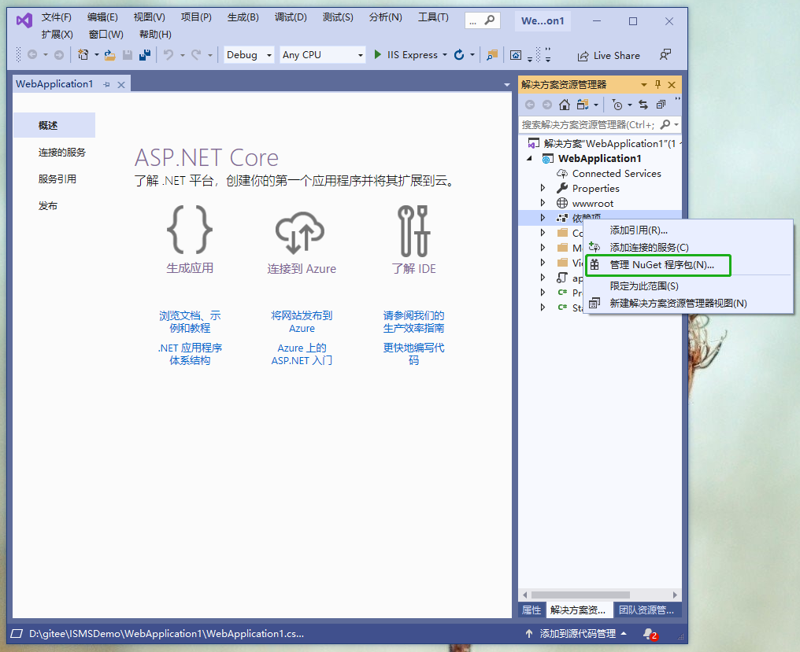
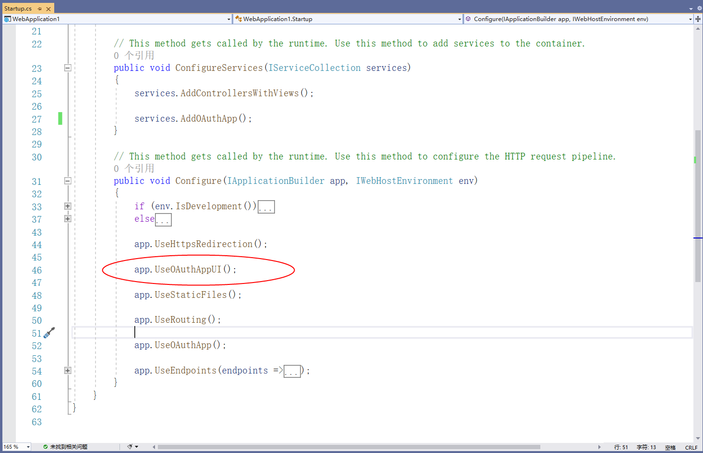
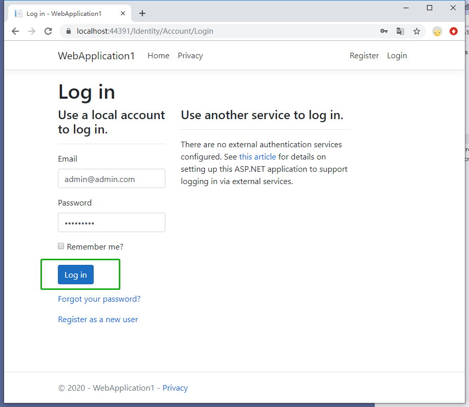
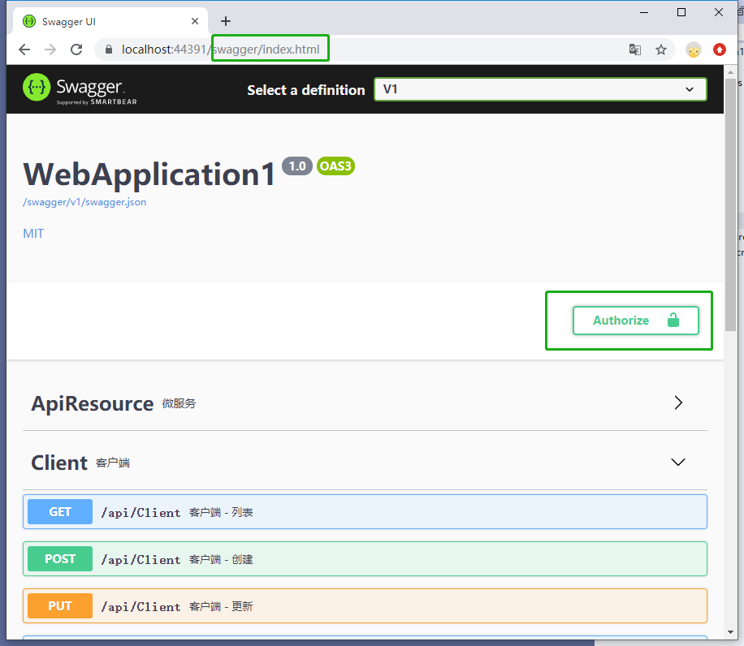
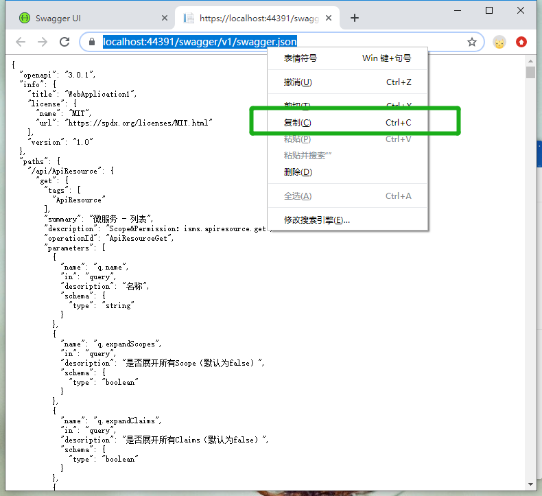
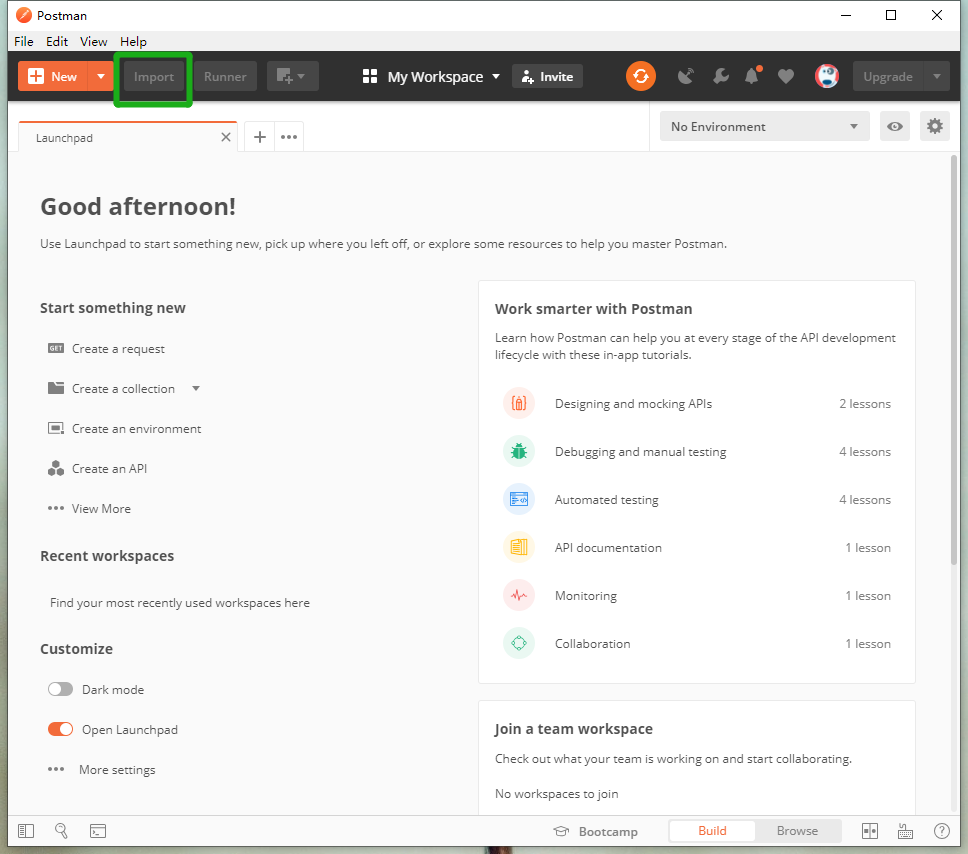

创建标识服务器
==================

.. Note::

	参考如下步骤，搭建标识服务器。请确保您已经安装了 `Visual Studio 2019 <https://visualstudio.microsoft.com/zh-hans/vs/>`_ 和 `DotNet Core 3.1 <https://dotnet.microsoft.com/download/dotnet-core/3.1>`_，以及 `SQL Server <https://www.microsoft.com/zh-cn/sql-server/sql-server-downloads>`_ 。

1，创建 AspNet Core Web 应用程序
------------------------------

.. image:: ./images/usecase-basic/startserver1.png
.. image:: ./images/usecase-basic/startserver2.png
.. image:: ./images/usecase-basic/startserver3.png
.. image:: ./images/usecase-basic/startserver4.png

2，安装 Nuget程序包
---------------
- 对项目的 **依赖项** 点右键，选择 **管理Nuget程序包**

- 输入 **IdentityServer4MicroService** ，然后点击安装
.. image:: ./images/usecase-basic/startserver6.png

3，配置
----------------------------

appsetting.json
^^^^^^^^^^^^^^^^^^^^^^^^^^^

- 对 **项目** 点击右键——属性——调试，复制项目网址
.. image:: ./images/usecase-basic/startserver7.png

- 复制下面代码到 **appsetting.json** ，注意将Host节点替换为当前项目网址，**结尾不要带“/”**

- **DataBaseConnection** 可替换为实际数据库的地址，**SMS** 和 **Email** 为 `sendcloud <https://sendcloud.sohu.com/>`_ 的服务，可空

.. code-block:: javascript
  
  "ConnectionStrings": {
    "DataBaseConnection": "Data Source=(localdb)\\ProjectsV13;Initial Catalog=ismsdb_demo;Integrated Security=True;Pooling=False",
    "AzureStorageConnection": "可空"
  	},
  "IdentityServer": {
    "Host": "当前项目网址，结尾不要到/",
    "SMS": {
      "apiUser": "可空",
      "apiKey": "可空"
    },
    "Email": {
      "apiUser": "可空",
      "apiKey": "可空",
      "fromEmail": "可空",
      "fromName": "可空"
    }
  }

|
.. image:: ./images/usecase-basic/startserver8.png

Identity UI
^^^^^^^^^^^^^^^^^^^^^^^^^^^

- 打开项目的 **Views/Shared/_Layout.cshtml** 文件，添加登陆组件。
 
.. code-block:: html

    <partial name="_LoginPartial" />

.. image:: ./images/usecase-basic/startserver9.png

添加并引用服务
^^^^^^^^^^^^^^^^^^^^^^^^^^^

- 打开 **Startup.cs** 文件，添加如下代码。( **注释app.UseAuthentication()**)

.. code-block:: csharp

    services.AddIdentityServer4MicroService();
    app.UseIdentityServer4MicroService();

4，启动
--------------

.. Note::

	启动项目并预览。默认用户账号：admin@admin.com，密码：123456aA!，拥有所有权限。

.. image:: ./images/usecase-basic/startserver11.png

.. image:: ./images/usecase-basic/startserver13.png
.. image:: ./images/usecase-basic/startserver14.png

6，Swagger UI
--------------

- 在浏览器中打开 **{项目网址}**/swagger/index.html可访问API文档。

.. image:: ./images/usecase-basic/startserver16.png
.. image:: ./images/usecase-basic/startserver17.png
.. image:: ./images/usecase-basic/startserver18.png

- 可访问 **{项目网址}**/grants，撤销对指定client的授权。

.. image:: ./images/usecase-basic/startserver19.png

7，Postman
--------------

- Postman下载地址：https://www.postman.com/downloads/

.. image:: ./images/usecase-basic/startserver20.png

.. image:: ./images/usecase-basic/startserver23.png
.. image:: ./images/usecase-basic/startserver24.png
